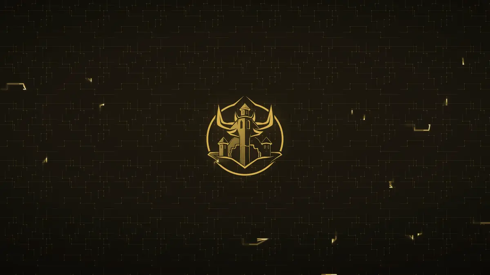

# Bulwark Black

An Omarchy theme: near-black warmed toward gold, with a teal secondary accent
and a circuit-board wallpaper. Derived from the CSS custom properties of
[bulwarkblack.com](https://bulwarkblack.com) — the backgrounds, the `#e0b64d`
gold and the `#4fd1c5` teal are the site's own values, not an interpretation
of them.



The comets above are the wallpaper's own, moving. They are drawn along the
circuit traces by a bundled shell plugin — vector animation in Omarchy's
own renderer, no video and no background daemon. The theme installs static;
the motion is opt-in and documented under
[Live comets and the logo picker](#live-comets-and-the-logo-picker-optional-plugins).

## Install

```bash
omarchy theme install https://github.com/Bulwark-Black/omarchy-bulwark-black-theme.git
omarchy theme set "Bulwark Black"
```

Or from the Omarchy menu: **Install → Style → Theme**, then paste the URL.

That clones the theme into `~/.config/omarchy/themes/bulwark-black` and leaves
your shell wherever it was, so every command below is written against that path
rather than relative to it. Set it once per shell:

```bash
THEME=~/.config/omarchy/themes/bulwark-black
```

If you cloned the repo by hand instead, point `THEME` at your checkout — nothing
below cares which one it is.

## What's in it

| File | What it does |
|---|---|
| `colors.toml` | The palette. |
| `icons.theme` | `Yaru-yellow-dark`, the closest icon set to the gold. |
| `shell.*.toml` | Popup, tooltip, notification, launcher and menu surfaces. |
| `backgrounds/` | Three 4K wallpapers. |

### Why the `shell.*.toml` files exist

Omarchy paints every flyout with the theme's `background`. Most themes get away
with that because their background is already tinted — catppuccin is `#1e1e2e`,
tokyo-night `#1a1b26`. This theme's is `#18140c`, dark enough that popups would
read as flat black. These five files lift those surfaces to `#201b0f`.

Scrims stay at true near-black, and the lock and polkit screens are left alone —
a warm cast doesn't belong on a full-screen auth surface.

The values are literal, and Omarchy applies section overrides *after* template
rendering, so they don't track `colors.toml`. Change the palette and these want
revisiting too.

### The neutral axis is tinted

Backgrounds, `selection` and `muted` carry the accent hue rather than being
grey, with saturation rising as the levels get lighter — the same approach
`osaka-jade` takes with its green.

Lightness matters more than hue here. A first cut kept `background` at 4.7%
lightness and the tint was simply invisible; there is no room for a cast that
dark. It sits at 7% now, against osaka-jade's 8.8%, tokyo-night's 12.5% and
catppuccin's 14.9% — still the darkest of the four, which suits the name.

## Terminal

The theme maps ANSI `cyan` to the site's teal (`#4fd1c5`). To use it for `eza`'s
Date Modified column and file names, add to `~/.bashrc`:

```bash
export EZA_COLORS="da=36:fi=36"
```

`36` rather than the hex, so it follows whatever theme you switch to later.

## Using your own logo

The wallpaper ships with the Bulwark Black emblem. `make-wallpaper.py` will
rebuild it around your own mark, stripping it down and recolouring it to the
accent so it sits *in* the palette rather than on top of it.

```bash
$THEME/tools/make-wallpaper.py --logo mylogo.png -o mine.png
omarchy theme bg set "$PWD/mine.png"
```

Needs ImageMagick 7 (`magick`). No browser, no network. A 4K wallpaper takes
about ten seconds.

```
--logo PATH         your mark (default: the Bulwark emblem)
--logo-size PX      drawn size, 200..min(W,H); 0 omits it entirely
--comets N          bake in N static comets, 0-24 (see below)
--accent '#rrggbb'  recolour everything, if you fork the palette
--size WxH          default 3840x2160
--invert            for dark-on-transparent artwork
--erode PX          shrink the silhouette to drop edge artefacts (default 6)
--allow-plate       skip the solid-background check
```

### Logo guidelines

Processing keeps each pixel in proportion to its **brightness**, then paints
what survives in the accent colour. So:

- **A dark or transparent background — transparency is not required.** The mask
  is built from *brightness*, so anything dark drops out on its own: an opaque
  JPEG of a light logo on black works exactly as well as a transparent PNG. What
  fails is a light background (a logo on white), which becomes a gold slab with
  the mark cut out of it. The script checks for that and refuses.
- **Light artwork.** Dark-on-transparent art nearly vanishes — dark is exactly
  what gets dropped. Use `--invert`.
- **512×512 or larger**, and at least your `--logo-size` so it is never
  upscaled. 1024×1024 is a good default.
- **Roughly square.** Anything past 2.5:1 is refused; past 1.4:1 gets fitted
  into a square slot rather than cropped.
- **Simple, high-contrast shapes.** Photographs turn to mud against near-black,
  and an opaque photo is refused outright by the background check.
- **SVG works.** Vector logos are rasterised at high density first, so a 24×24
  viewBox (simple-icons and friends) is fine — the nominal size is ignored.
  Many icon sets ship black-on-transparent, which needs `--invert`.

The script refuses hard violations and warns about soft ones rather than
quietly producing something ugly. Every check has an explanation attached, and
`--allow-plate` exists for the case where your mark genuinely runs to the edge.

## When a logo is refused

The generator is strict on purpose, but a rejection is not a dead end.

```bash
$THEME/tools/logo-doctor.py mylogo.png          # what is wrong
$THEME/tools/logo-doctor.py mylogo.png --fix    # repair it
```

It repairs the three mechanical cases — a solid background (flood-filled from
the corners), dark artwork (inverted), a too-wide mark (padded square) — and
writes a file that needs no extra flags.

**This happens for you automatically.** If you pick a logo from the Comets
widget and it is refused, the repairs are attempted and, if they work, the
wallpaper is rebuilt and applied without you doing anything.

When a rejection needs judgement — usually "too small", which no processing can
fix — you get a notification offering to hand the job to whichever coding agent
you have configured. **Clicking it is the consent; nothing reaches an agent
until you do.** The agent receives a precise brief plus a skill describing how
the generator treats a logo and what "good" means:

```bash
$THEME/agents/install.sh
```

That symlinks `prepare-logo` into `~/.agents/skills`, `~/.claude/skills`,
`~/.codex/skills` and `~/.pi/agent/skills` — the same mechanism Omarchy uses for
its own skills, so it works with whichever agent you run.

## Syntax highlighting

Omarchy themes alacritty, ghostty, btop, helix, neovim and vscode from
`colors.toml`, so those pick the palette up automatically — Neovim included, via
`aether.nvim`.

It has no template for **bat**, which therefore stays on Monokai (bright pink and
lime) no matter which theme you run. To fix that:

```bash
$THEME/bat/install.sh
```

That installs `bat/Bulwark Black.tmTheme`, rebuilds bat's cache and sets it in
`~/.config/bat/config`. Functions take the brand gold, strings green, keywords
magenta, types teal. Undo with `sed -i '/^--theme=/d' ~/.config/bat/config`.

## GTK apps (Nautilus and friends)

Omarchy themes terminals, the shell, btop, helix, neovim and vscode — but has no
GTK template, so file managers and GNOME dialogs sit on stock Adwaita grey under
every theme.

```bash
omarchy hook install theme-set $THEME/tools/gtk-sync.sh
$THEME/tools/gtk-sync.sh          # apply now
```

That reads **whichever theme is current** and rewrites `~/.config/gtk-3.0/gtk.css`
and `~/.config/gtk-4.0/gtk.css` to match, then re-runs on every theme change. It
is deliberately not hardcoded to this palette — pin one theme's colours into
gtk.css and every *other* Omarchy theme ends up wearing them.

Undo: `rm ~/.config/gtk-{3.0,4.0}/gtk.css` and delete the hook from
`~/.config/omarchy/hooks/theme-set.d/`.

## Back to defaults

```bash
$THEME/tools/set-logo.sh --defaults
```

Restores the shipped Bulwark Black emblem, the branded wallpaper and the default
slider values in one step, and removes any custom wallpaper so the background
cycler stops offering it. Right-clicking the Comets bar icon does the same.

## Live comets and the logo picker (optional plugins)

The wallpaper this theme ships is **static**. On
[bulwarkblack.com](https://bulwarkblack.com) gold pulses travel along the circuit
traces; reproducing that on the desktop needs a **shell plugin**, because Omarchy
renders backgrounds with QML `Image`, which shows only the first frame of an
animated file.

Omarchy loads plugins from `~/.config/omarchy/plugins/` and never from a theme,
so installing the theme alone gets you the static wallpaper and the CLI
generator. For a hint of the motion without any plugin, bake some in:

```bash
$THEME/tools/make-wallpaper.py --comets 12 -o mine.png
```

`$THEME/plugins/` holds the two that add the real thing:

| Plugin | What it adds |
|---|---|
| `albert.background` | Animates comets along the circuit traces, live. |
| `albert.comets` | Bar widget: speed, thickness, count, logo size, the logo picker, and reset-to-defaults. |

The logo picker lives in that widget, so without it you swap logos from the
command line instead (`$THEME/tools/make-wallpaper.py --logo yours.png`).

The fork is **purely additive** — it adds one block to Omarchy's `Background.qml`
and removes nothing — so re-syncing after an update means re-applying that block
on top of the new upstream file.

**Read this before installing them.** `albert.background` is a *fork* of
Omarchy's own background plugin. It will not receive upstream fixes to
`Background.qml`, and after an Omarchy update it may need re-syncing against
`/usr/share/omarchy/shell/plugins/background/Background.qml`. Rename the `albert.`
prefix to your own username before use. This is the reason they are not part of
the theme proper.

### Installing them

`omarchy plugin add` clones a repo and expects `manifest.json` at the root of
it. These two sit in a subdirectory of the theme, so it cannot install them —
the copy is done here instead:

```bash
$THEME/plugins/install.sh
```

That copies both into `~/.config/omarchy/plugins/` and enables them.
`albert.background` stands in for Omarchy's own background plugin — that is
what `clonedFrom` in its manifest asks for — and `albert.comets` takes a place
on the right of the bar.

To take them out again:

```bash
$THEME/plugins/uninstall.sh
```

That removes both and re-enables Omarchy's own background plugin.

## Uninstall

The scripts that undo the plugins and the agent skill live *inside* the theme,
and `omarchy theme remove` deletes the directory they are in. So run them
first:

```bash
$THEME/plugins/uninstall.sh
$THEME/agents/uninstall.sh
omarchy theme remove bulwark-black
```

Remove the theme first and you are left with a background plugin forked from a
theme that no longer exists, Omarchy's own still disabled behind it, four
dangling `prepare-logo` symlinks in the agent skill directories — and nothing
on disk to undo any of it.

The bat theme and the GTK hook install outside the theme directory and survive
its removal; their undo lines are with the sections that install them.

## Related work

Animating an Omarchy background is well-trodden ground. This theme is not the
first to do it, and not the first to do it natively either. If a different approach suits you better, these are worth
looking at:

- [`WSeubring/omarchy-pokemon-theme`](https://github.com/WSeubring/omarchy-pokemon-theme)
  — the closest prior art: a theme that ships its own declared fork of
  `plugins/background/`, doing hand-rolled QtQuick ambient motion over the
  wallpaper with no video and no daemon. The same architecture as this.
- [`vinceferro/omarchy-universe-background`](https://github.com/vinceferro/omarchy-universe-background)
  — native motion again, via a GLSL shader over a live webp.
- [`0x1ocean/omarchy-omatrix`](https://github.com/0x1ocean/omarchy-omatrix) —
  procedural matrix rain, split into a plugin plus a theme, with a neat opt-in:
  the plugin only draws when the active theme ships an `omatrix.toml`. A cleaner
  handshake than the filename check used here.
- [`xadacka/omarchy-vaporwave-background`](https://github.com/xadacka/omarchy-vaporwave-background)
  — the same shape as this one: a `Background.qml` fork that keeps the still
  wallpaper and layers procedural motion over it.
- [`ivanskodje/omarchy-animated-backgrounds`](https://github.com/ivanskodje/omarchy-animated-backgrounds)
  — procedural effects on a layer above the wallpaper, leaving the stock
  renderer untouched.
- [`yesheytenzin/live-wallpaper`](https://github.com/yesheytenzin/live-wallpaper)
  and [`guiestrela/wallpaper-omarchy-manager`](https://github.com/guiestrela/wallpaper-omarchy-manager)
  — if you want actual video wallpapers rather than vector motion.

What is specific here is only the treatment: the motion is the site's own
circuit traces carrying its own gold, drawn as vector shapes rather than decoded
from a file, so there is no video and no wallpaper daemon.

## Credits

Circuit pattern and palette from bulwarkblack.com. Theme and wallpaper
generator by Bulwark Black LLC.

The **Bulwark Black name and emblem are trademarks** and are not covered by the
licence below. Fork the palette and the generator freely; please swap the logo
for your own (`$THEME/tools/make-wallpaper.py --logo yours.png`) rather than
shipping ours under another name.
